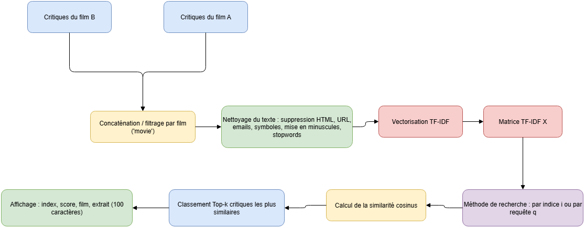

# Analyse de similarité des critiques de films
## 1. Présentation du projet
Ce projet vise à **comparer et recommander des critiques de films similaires** à partir de deux jeux de données : *Fight Club* et *Interstellar*

L’analyse combine des techniques de **traitement du langage naturel (NLP)** et de **similarité vectorielle (TF-IDF + cosinus)**.  
Elle permet d’identifier :
- Les critiques les plus proches d’une critique donnée ;  
- Les critiques similaires à une requête textuelle libre (par ex. *“incroyable musique et acteurs”*) ;  
- Les points communs lexicaux et émotionnels entre les deux films.

## 2. Structure du dépôt
- recommandation_Critiques_Semblable.ipynb   # Notebook principal

- interstellar_critique.csv                  # Données des critiques d'Interstellar

- fight_club_critique.csv (optionnel)        # Données des critiques de Fight Club
- Schéma.drawio.png # Schéma de l’algorithme
## 3. Méthodologie

Le pipeline complet du projet est illustré ci-dessous  



### Étapes principales :
1. **Chargement des données**  
   Importation des critiques des deux films et ajout d’une colonne `movie` pour identifier leur provenance.  

2. **Nettoyage du texte**  
   - Suppression des balises HTML, des liens, des emails et des caractères spéciaux  
   - Conversion en minuscules  
   - Suppression des stopwords français  

3. **Vectorisation TF-IDF**  
   Représentation numérique de chaque critique selon la fréquence et l’importance des mots.
   
   Pourquoi ce choix ?

   Simplicité et efficacité : TF-IDF est rapide à calculer et très performant pour les tâches de similarité textuelle.

4. **Calcul de la similarité cosinus**  
   Mesure de proximité entre les critiques vectorisées.

   Le couple TF-IDF + similarité cosinus est un standard classique mais robuste pour les systèmes de recommandation et la recherche de textes similaires.

5. **Recherche des plus proches voisins (Top-k)**  
   - Par **indice de critique**  
   - Par **requête textuelle libre**

6. **Affichage des résultats**  
   - Index de la critique similaire  
   - Score de similarité  
   - Film d’origine  
   - Texte complet

## 4. Exécution du Notebook
**Prérequis**

Installer les bibliothèques nécessaires :

```python
pip install pandas scikit-learn nltk beautifulsoup4
```

### Lancer l’analyse

1. Ouvrir le notebook recommandation_Critiques_Semblable.ipynb

2. Exécuter les cellules dans l’ordre

3. Modifier la variable :
```python
target = 'interstellar'   # ou 'fightclub'
```

pour basculer entre les deux films.


## 5. Exemple de résultat
```txt
[interstellar] Critique n°90 :
film incroyablement émouvant, la musique est magnifique...

Critiques les plus similaires :
[247] sim=0.143 | j’ai vu dans interstellar ce qu’aurait dû être prometheus...
[512] sim=0.139 | un chef-d’œuvre visuel et sonore...
[733] sim=0.136 | incroyable bande son et effets spéciaux...
```
## 6. Pistes d’amélioration

- Utiliser Word2Vec, Doc2Vec ou BERT pour une similarité sémantique plus fine.

- Développer une interface web interactive (avec Streamlit ou Flask).

- Ajouter une analyse de sentiment des critiques pour enrichir les recommandations.

## 7. Références et sources d’inspiration

Ce projet s’inspire partiellement de ressources disponibles sur Kaggle, notamment pour la partie prétraitement du texte et la vectorisation TF-IDF :

1. **CoLearning Lounge (Kaggle)** —  
   *NLP Data Preprocessing and Cleaning*  
   https://www.kaggle.com/code/colearninglounge/nlp-data-preprocessing-and-cleaning#Time-for-some-Cleaning!

2. **Selene R. (Kaggle)** —  
   *Multi-Class Text Classification TF-IDF*  
   https://www.kaggle.com/code/selener/multi-class-text-classification-tfidf#Text-Preprocessing

Merci aux auteurs pour leurs notebooks pédagogiques, qui ont inspiré la construction du pipeline de ce projet.
